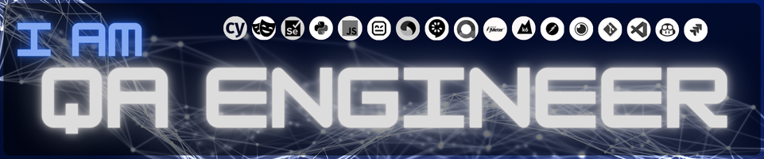

## 🪲 Bruno QA

## 🧔🏿‍♂️ A little about me:
With a degree in Systems Analysis and Development, and a postgraduate degree in
Software Engineering with a focus on Software Quality and Testing from Anhanguera
University, i have extensive experience in software testing, covering Web, Mobile Apps,
and APIs.

## 🛠️ Tools & Technologies

#### 🌐 Web Test Automation

#### 📱 Mobile Test Automation

#### 🖥️ Desktop Test Automation

#### 🗃️ API Test Automation

#### 🗂️ API Testing Tools

#### 📝 Programming Languages

#### 🛠️ Development & Management Tools

<!--
**BrunoQA-Engineer/BrunoQA-Engineer** is a ✨ _special_ ✨ repository because its `README.md` (this file) appears on your GitHub profile.

Here are some ideas to get you started:

- 🔭 I’m currently working on ...
- 🌱 I’m currently learning ...
- 👯 I’m looking to collaborate on ...
- 🤔 I’m looking for help with ...
- 💬 Ask me about ...
- 📫 How to reach me: ...
- 😄 Pronouns: ...
- ⚡ Fun fact: ...
-->
